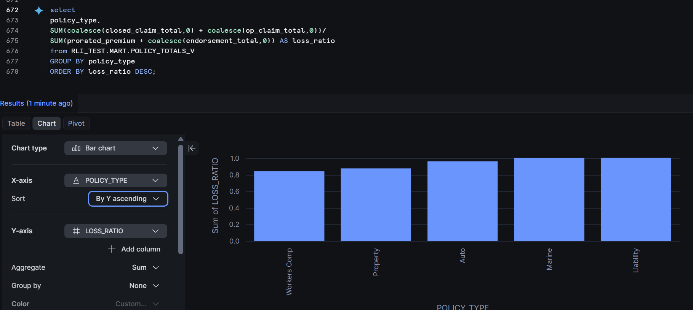
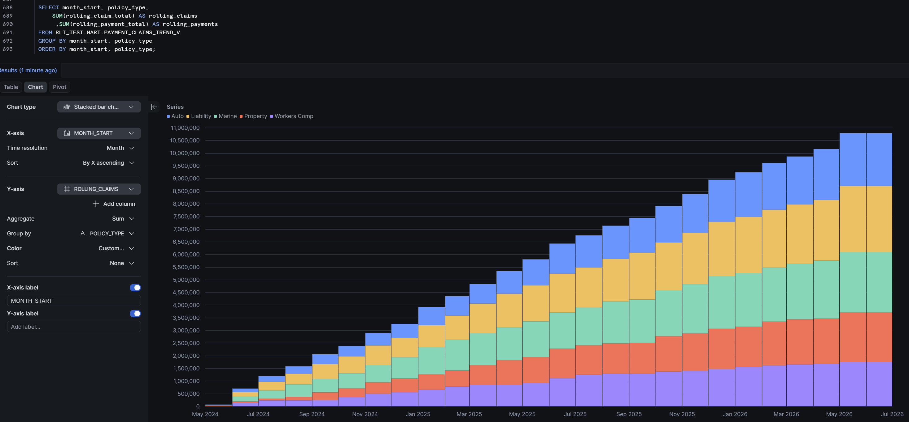
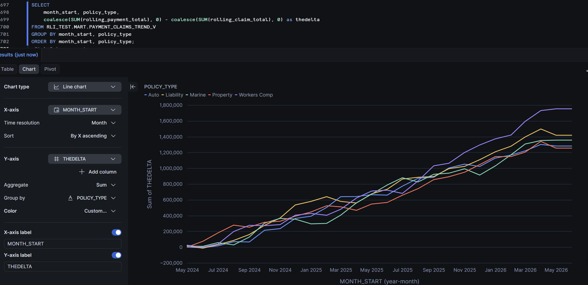
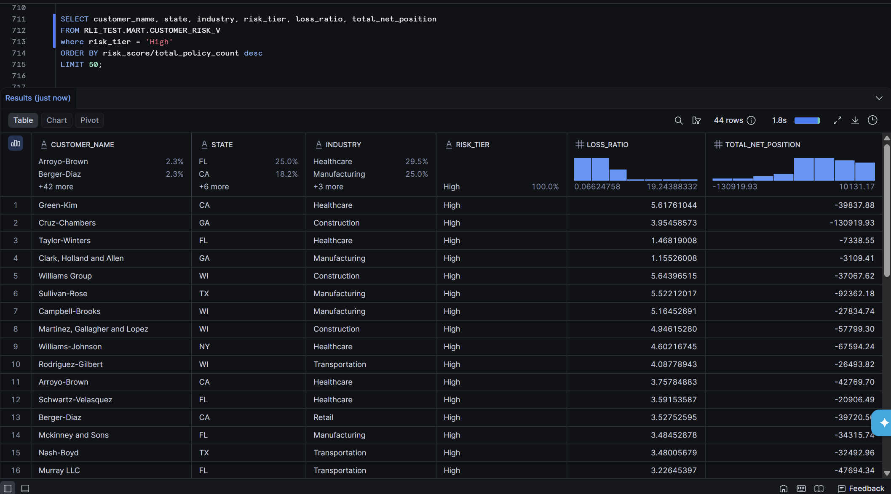
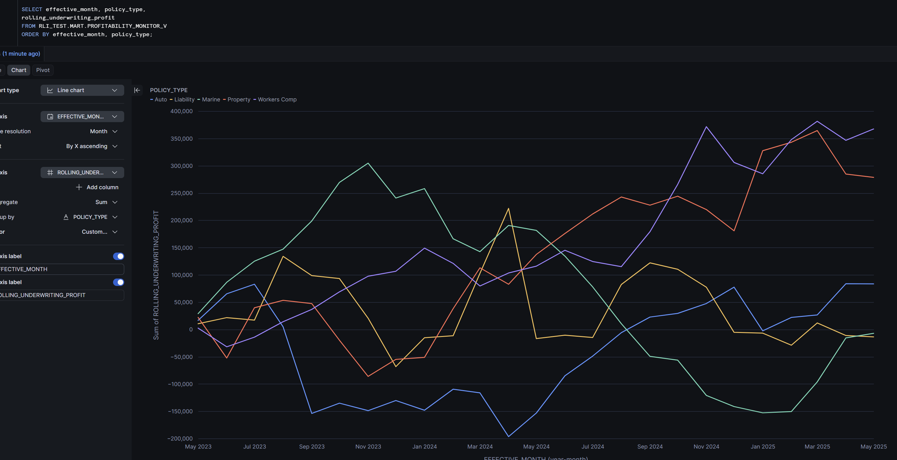

# RLI Insurance — Senior Data Engineer — Take-Home

## Overview

This project transforms five raw insurance datasets into a curated analytics layer designed to support operational and executive reporting on policy performance. The solution is implemented entirely in Snowflake using a three-layer architecture — RAW, STAGE, and MART — with a data quality framework that identifies and isolates data issues rather than silently dropping them.

---

## Architecture

The solution follows a three-layer medallion pattern:

| Layer | Purpose |
|-------|---------|
| **RAW** | Source-faithful ingestion. Data loaded exactly as provided. Never modified after load. |
| **STAGE** | Cleansing and validation. Data Quality rules applied via tagged views. Invalid records isolated. |
| **MART** | Analytics layer. Purpose-built views answering each business question directly. |

### Why three layers?

- **RAW preserves lineage** — keeping source data untouched enables full reprocessing if transformation logic changes
- **STAGE centralizes Data Quality logic** — a tagged view pattern ensures rules are defined once and inherited by both clean views and the Data Quality audit views
- **MART abstracts complexity** — downstream BI tools and analysts consume clean, pre-aggregated views without needing to understand the underlying joins or business rules

---

## Repository Structure

```
RLI_Test/
├── README.md
├── Data/
│   ├── customers.csv
│   ├── policies.csv
│   ├── claims.csv
│   ├── payments.csv
│   └── endorsements.json
├── Docs/
│   ├── 1_Loss_Ratio_by_Policy_Type.png
│	├── 2_Claims_Trends_by_Policy.png
│	├── 2_Payments_Minus_Claims_Trends_by_Policy.png
│	├── 3_High_Risk_Customers.png
│	└── 4_Profitability_Monitor.png
├── Raw/
│   ├── automation_concept.sql
│   ├── ingestion.sql
│   ├── CLAIMS.sql
│   ├── CUSTOMERS.sql
│   ├── ENDORSEMENTS.sql
│   ├── PAYMENTS.sql
│   └── POLICIES.sql
├── Stage/
│   ├── CLAIMS_DQ_V.sql
│   ├── CLAIMS_V.sql
│   ├── CUSTOMERS_V.sql
│   ├── ENDORSEMENTS_V.sql
│   ├── PAYMENTS_DQ_V.sql
│   ├── PAYMENTS_V.sql
│   ├── POLICIES_TAGGED_V.sql
│   └── POLICIES_V.sql
└── Mart/
    ├── CUSTOMER_RISK_V.sql
    ├── PAYMENT_CLAIMS_TREND_V.sql
    ├── POLICY_TOTALS_V.sql
    └── PROFITABILITY_MONITOR_V.sql
```

> **To reproduce:** Create a Snowflake account, run `Raw/ingestion.sql` first to set up the database and load source data, then run remaining: `Raw/` → `Stage/` → `Mart/` scripts in order.

---

## Data Model

### RAW Schema

Five tables loaded from source files via Snowflake internal stage and `COPY INTO`:

| Table | Source | Rows |
|-------|--------|------|
| `POLICIES` | policies.csv | 1,004 |
| `CUSTOMERS` | customers.csv | 352 |
| `CLAIMS` | claims.csv | 425 |
| `PAYMENTS` | payments.csv | 3,554 |
| `ENDORSEMENTS` | endorsements.json | 50 |

Data exists in identical form to the source — no transformations applied at this layer. An `_insrt_ts` timestamp column tracks load time for lineage purposes.

> **Note on ingestion:** For this exercise data was loaded manually via Snowflake's internal stage and `COPY INTO`. In a production environment this layer would be populated by an automated pipeline triggered on file arrival, implemented via Snowflake Tasks and Streams or an ELT tool such as Fivetran or dbt.

> **Note on constraints:** Snowflake primary key and unique constraints are informational only and not enforced at the database level. Duplicate detection is therefore handled explicitly in the staging layer via window functions rather than relying on database constraints.

---

### STAGE Schema

Clean views for all five entities: `POLICIES_V`, `CUSTOMERS_V`, `CLAIMS_V`, `PAYMENTS_V`, `ENDORSEMENTS_V`.

**Data Quality approach:**

DQ logic is applied in two complementary ways across the staging layer:

- `POLICIES_TAGGED_V` — implements the tagged view pattern, assigning  a `dq_reason` to every invalid row for audit purposes
- `POLICIES_V` — applies DQ rules inline via `WHERE` filters and  `QUALIFY`, reading directly from `RAW.POLICIES`
- `CLAIMS_DQ_V` and `PAYMENTS_DQ_V` — surface rejected rows using  `MINUS` against their respective clean views

In a production implementation the tagged view pattern would be extended consistently across all five entities, with clean views reading exclusively from their tagged counterparts. This is noted as a future enhancement.

**Key design decision:** FK validation in `CLAIMS_V` and `PAYMENTS_V` runs against `STAGE.POLICIES_V` rather than `RAW.POLICIES`. This ensures records referencing policies excluded for Data Quality reasons are also excluded, maintaining referential integrity across the staging layer.

---

### MART Schema

| View | Grain | Answers |
|------|-------|---------|
| `POLICY_TOTALS_V` | One row per policy | Base view — aggregated claims, payments, endorsements, earned premium |
| `PAYMENT_CLAIMS_TREND_V` | Month × Policy Type × Industry × State | How do claims and payments trend across segments? |
| `CUSTOMER_RISK_V` | One row per customer | Which customers represent elevated financial risk? |
| `PROFITABILITY_MONITOR_V` | Month × Policy Type | How can leadership monitor profitability over time? |

---

## Business Questions

### 1. Which policy types are generating the highest loss ratios?

Answered by querying `POLICY_TOTALS_V` grouped by `policy_type`.

**Loss ratio formula:**
```sql
SUM(total_claims) / SUM(prorated_premium + endorsement_adjustments)
```

**Key findings:** Liability and Marine show the highest loss ratios at 1.0, indicating claims are nearly equal to earned premium for these segments. Workers Comp shows the lowest loss ratio at approximately 0.8, making it the most profitable policy type. 


---

### 2. How do claims and payments trend across different policy segments?

Answered by `PAYMENT_CLAIMS_TREND_V`.

- Monthly grain using `DATE_TRUNC('month')`
- A **calendar spine** ensures all months appear in the trend regardless of activity — prevents gaps in BI visualizations
- Rolling totals via `SUM() OVER (... ROWS BETWEEN UNBOUNDED PRECEDING AND CURRENT ROW)` provide cumulative trend visibility
- Segmented by `policy_type`, `industry`, and `state`

**Key findings:** All five policy types show a positive and growing payment surplus over the analysis period, indicating collected premiums are outpacing claims across segments. Workers Comp shows the highest cumulative payment surplus. The rolling claims chart confirms steady growth in claims exposure across all types with no single segment showing disproportionate acceleration.



---

### 3. Which customers or policy groups represent elevated financial risk?

Answered by `CUSTOMER_RISK_V`.

Four independent risk flags are evaluated per customer — each measures a distinct dimension of risk:

| Flag | Condition | Measures |
|------|-----------|----------|
| `flag_negative_position` | `prorated_net_position < 0` | Overall profitability |
| `flag_open_exposure` | `open_claims / total_claims > 0.5` | Claims uncertainty |
| `flag_collection` | `payments_collected / adjusted_premium < 0.5` | Payment delinquency |
| `flag_high_frequency` | `total_claims / policy_count > 2` | Claims volume |

Risk tier is scaled relative to policy count — a customer with more policies is held to a proportionally higher standard before being flagged:

| Risk Tier | Condition |
|-----------|-----------|
| `High` | `risk_score > policy_count` |
| `Medium` | `risk_score > policy_count * 0.5` |
| `Low` | `risk_score > 0` |
| `No Risk` | `risk_score = 0` |

Individual flags are exposed as columns so the business can understand *why* a customer is flagged, not just *that* they are flagged.

**Key findings:** 44 customers are flagged as HIGH risk with most showing negative net positions and loss ratios significantly above 1.0. 

Pictured below are some customers with a 'High' Risk Tier which includes their Total Net Position(Premium + Endorsements - Claims) and Loss Ratio(Claims - Prorated Premium + Endorsements).



---

### 4. How can leadership monitor policy profitability and claims exposure over time?

Answered by `PROFITABILITY_MONITOR_V`.

- Time series based on policy effective month by policy type
- Monthly underwriting profit: `prorated_premium + endorsements - total_claims`
- Rolling underwriting profit and rolling loss ratio show cumulative trends
- `profitability_status` flag — **Healthy / At Risk / Unprofitable** — provides an at-a-glance executive signal
- Open claims exposure tracked separately from closed claims

**Key findings:** Marine shows the strongest early profitability peaking around Nov 2023, but experiences significant volatility through 2024. Auto shows a sustained negative position through mid-2024 before recovering. By mid-2025 Property and Workers Comp show the most consistent upward rolling profit trends. Liability remains relatively stable throughout the period.



---

## Data Quality Findings

The dataset contained several intentional data quality issues. Each was identified and handled explicitly rather than silently dropped. Rejected rows are visible via the `CLAIMS_DQ_V` and `PAYMENTS_DQ_V` audit views.

### Duplicate records
- **CLAIMS:** `claim_id = 1` appears twice. Both records excluded from `CLAIMS_V`.
  - Duplicate detection runs against `RAW.CLAIMS` before any join filtering — this ensures both duplicates are caught even when one also has an invalid FK.

### Orphan foreign keys
- **CLAIMS:** `claim_id = 1` also references `policy_id = 999999` which does not exist in the policies table. Excluded via duplicate PK removal.
- **CLAIMS:** `claim_id = 411` references `policy_id = 6` which was excluded from `POLICIES_V` due to a null premium. Excluded from `CLAIMS_V` because FK validation runs against the staging layer, not raw.
- **PAYMENTS:** Several payments reference policy IDs excluded at the staging layer. Visible in `PAYMENTS_DQ_V`.

### Missing values
- **POLICIES:** `policy_id = 6` has a null premium. Excluded from `POLICIES_V`.

### Negative financial amounts
- **PAYMENTS:** One negative payment amount identified. Retained as a potential credit — visible in `PAYMENTS_DQ_V`.
- **ENDORSEMENTS:** Several endorsement amounts have signs that contradict their endorsement type — Coverage Increase records with negative amounts and Coverage Reduction records with positive amounts. See Assumptions section.

### Invalid date relationships
- **POLICIES:** `policy_id = 21` has `expiration_date` before `effective_date`. Excluded from `POLICIES_V`.
- **PAYMENTS:** 1,124 payments occur after policy expiration date. Given the volume, this likely represents legitimate run-off payments rather than data errors. Retained in the staging layer pending business confirmation.
- **ENDORSEMENTS:** 9 payments occur after cancellation dates. Flagged for review.

---

## Assumptions

The following assumptions were made during development. Per RLI's guidance, reasonable assumptions were documented rather than escalated.

### Loss ratio calculation
Loss ratio is calculated as `total_claims / (prorated_premium + endorsement_adjustments)`. Both open and pending claims are included in the numerator as they represent known exposure. In a production environment the loss ratio would be calculated on an accident-year basis to properly match claims to the period in which they were incurred.

### Prorated premium
Premium is prorated based on elapsed policy days:

```sql
premium * (
    DATEDIFF('day', effective_date, LEAST(CURRENT_DATE, expiration_date))
    / NULLIF(DATEDIFF('day', effective_date, expiration_date), 0)
)
```

This correctly handles both active policies (partial period) and expired policies (full premium earned). `NULLIF` protects against divide-by-zero on policies with invalid date ranges.

### Endorsement amounts
Endorsement amounts were treated as direct premium adjustments regardless of sign. Contradictory signs (Coverage Increase with negative amounts) were flagged as data quality issues but not excluded, as the business may have legitimate reasons for this pattern.

### Open vs pending claims
Both Open and Pending claims are grouped as unresolved exposure in loss ratio calculations. They are broken out separately in the mart views so the business can distinguish actively settling claims from unreviewed filings.

### Risk scoring thresholds
Customer risk flags use the following thresholds, which would be calibrated with the underwriting team in a production environment:

| Flag | Threshold |
|------|-----------|
| Negative net position | `prorated_net_position < 0` |
| Open exposure ratio | `open_claims / total_claims > 0.5` |
| Collection ratio | `payments / adjusted_premium < 0.5` |
| Claim frequency | `> 2 claims per policy` |

### Payments after expiration
1,124 payments occurring after policy expiration were retained rather than excluded. The volume suggests these represent legitimate run-off payments. In production this would be confirmed with the business before any exclusion logic was applied.

---

## Future Enhancements

- **Automated ingestion pipeline** replacing manual load, implemented via Snowflake Tasks and Streams or Fivetran. See automation_concept.sql.
- **dbt transformation layer** for version-controlled, testable, and documented SQL transforms
- **Calendar spine** added to `PROFITABILITY_MONITOR_V` for gap-free time series, consistent with `PAYMENT_CLAIMS_TREND_V`.  Omitted in this version as effective_date provides sufficient time coverage for the current dataset.
- **Accident-year loss ratio** calculation for actuarial accuracy
- **Risk threshold calibration** with the underwriting team based on historical loss data
- **Snowflake RBAC** row-level access controls to restrict mart access by business role
- **Tagged view pattern** extended to all staging entities for consistent DQ framework across all five tables

---

## Technology

- **Platform:** Snowflake (trial account)
- **Ingestion:** Snowflake internal stage + COPY INTO
- **Transformation:** Snowflake views with window functions, CTEs, QUALIFY clause
- **Data Quality:** Tagged view pattern + MINUS-based audit views
- **Version Control:** GitHub
